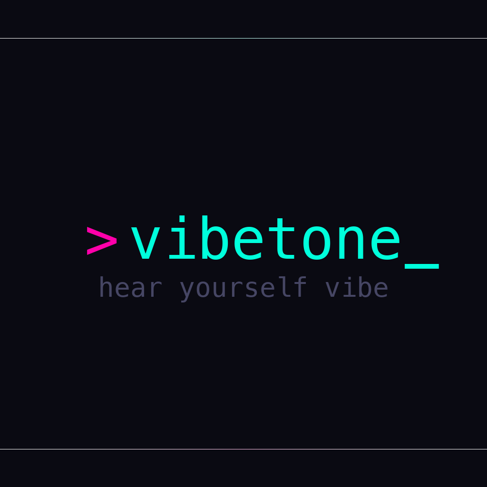

<p align="center">
  
</p>

<h3 align="center">hear yourself vibe</h3>

---

Real-time sidetone for vibe coders. Routes your mic to your headphones so you don't slur your words while you're deep in the zone.

```
~1.3ms latency  //  noise gate  //  voice filter  //  cyberpunk ui
```

---

### `> install_`

Requires [Rust](https://rustup.rs/).

**macOS / Linux:**

```bash
git clone git@github.com:GantisStorm/vibetone.git
cd vibetone
./release.sh
```

**Windows (PowerShell):**

```powershell
git clone git@github.com:GantisStorm/vibetone.git
cd vibetone
.\release.ps1
```

Then run `vibetone` from anywhere.

---

### `> dev_`

```bash
./dev.sh
```

Builds debug and runs immediately.

---

### `> features_`

```
[x] device selection (input/output)
[x] configurable buffer size + sample rate
[x] volume control
[x] noise gate w/ adjustable threshold
[x] voice filter (100Hz HPF / 8kHz LPF)
[x] cyberpunk terminal ui
```

---

```
built with rust  //  powered by cpal + egui  //  vibe coded with claude
```
